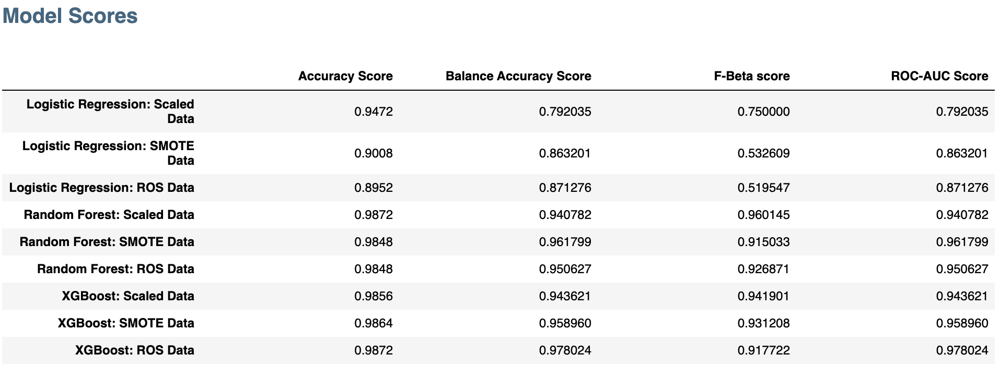
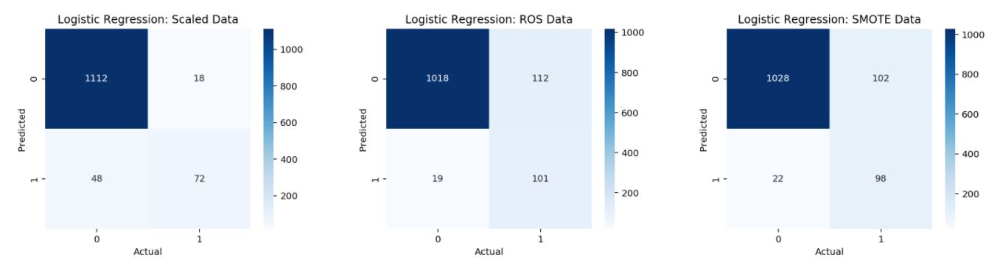
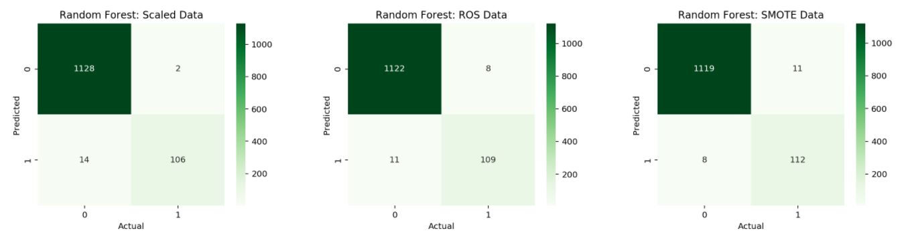
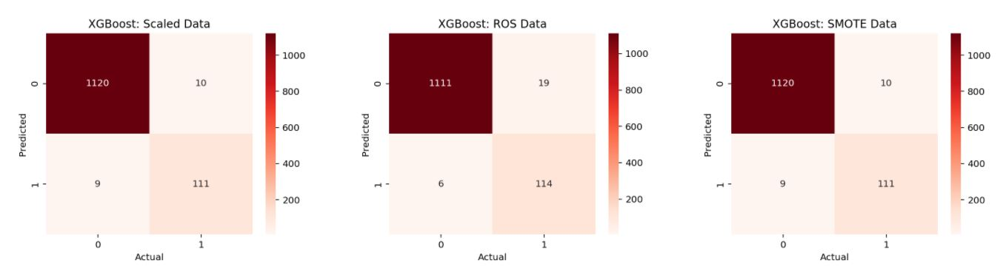
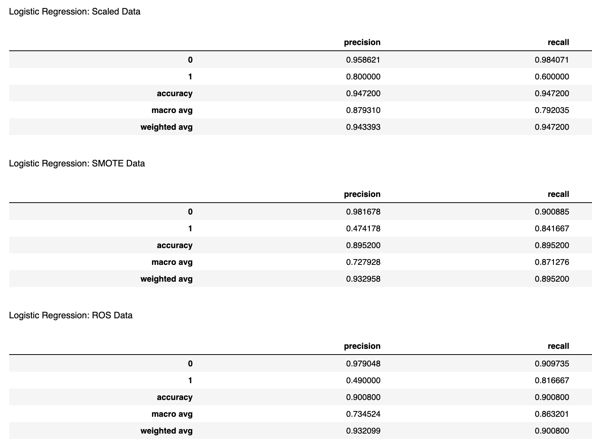
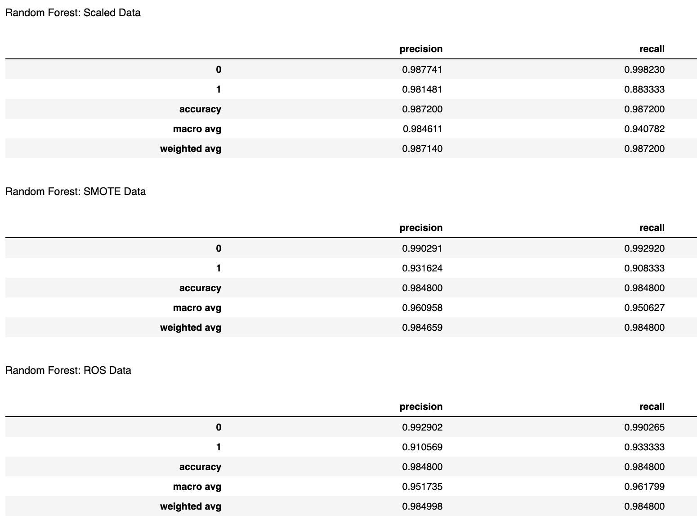
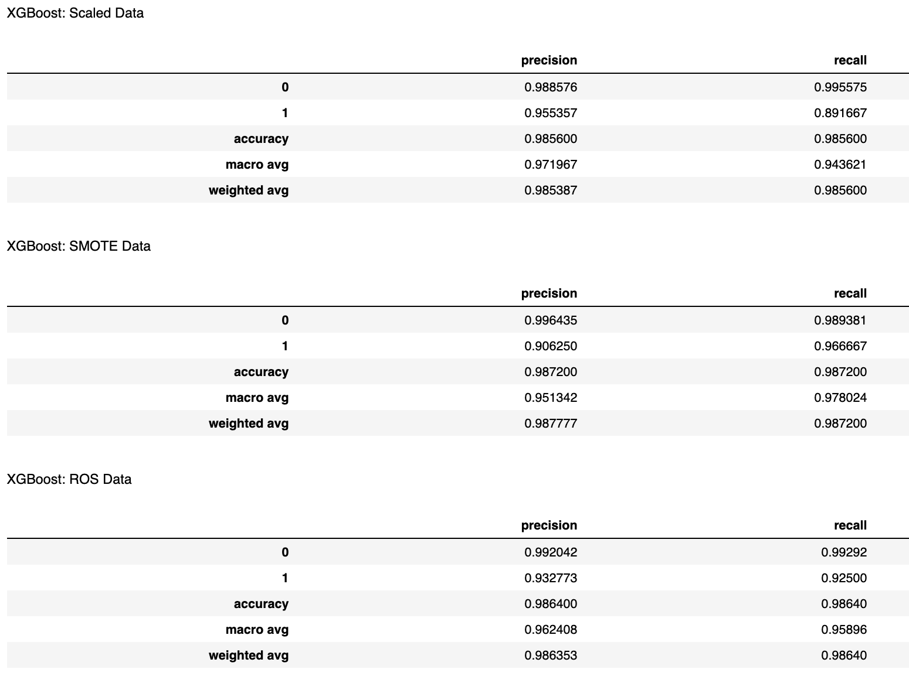
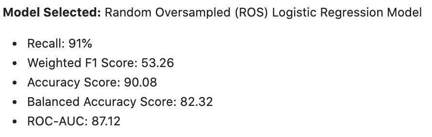
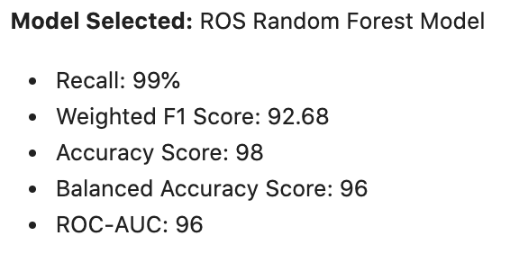
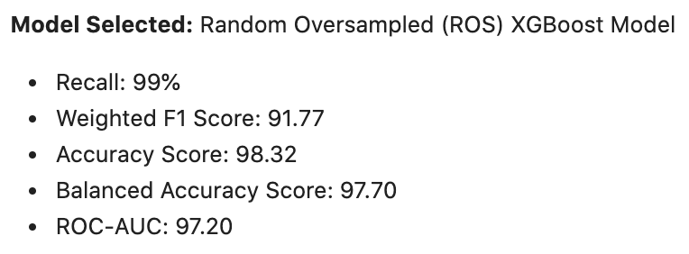

# Personal Loan Classification Model Summary of Findings

*This summary of findings document reports the final analysis and conclusion in the Project 2: Personal Loan Classification Model assignment.* 

---

## Sections

- [Model Analysis & Evaluation Metrics](#Model-Analysis-&-Evaluation-Metrics)
- [Model Scores](#Model-Scores)
- [Confusion Matrix](#Confusion-Matrix)
- [Classification Report](#Classification-Report)
- [General Model Performance](#General-Model-Performance)

---

## Model Analysis & Evaluation Metrics  

The goal of the classification model was to test three supervised learning models; logistic regression, random forest classifier, and extreme gradient boosting (XGBoost) to form a predictive model that would determine the liklihood an account holder at Thera Bank would be to take out a personal loan. 

Based on the objective and the evaluation of the three models, it was determined the XGBoost machine learning algorithm paired with the random oversampled data provided the best predicted results of the three models. 

The model valuation was based on six key metrics that were able to resolve a binary problem; *will the Thera Bank account holder take out a personal loan or, will they not?* 

The key evaluation metrics are; 

1. Accuracy Score
2. Balanced Accuracy Score
3. Confusion Matrix
4. Classification Report
5. Weighted F1 Scores
6. Feature Importance 

The evaluation metrics were selected to optimize the decision of the final model chosen to be used as the classification model for the campaign launched by Thera Bank to increase the consumer base of asset customers. Additionally, six metrics were chosen to evaluate each model and data set (ROS data and SMOTE data) to address overfitting problems in order to handle the target minority class imbalance present in the data. 

---

## Model Scores

The following section focuses on highlighting the results for each models;

- Accuracy Score
- Balanced Accuracy Score
- Weighted F1 Score
- ROC-AUC Score

### Key Metrics to Highlight: 

#### Accuracy & Balanced Accuracy Score

Calculating the accuracy and balanced accuracy score for each model was important for two reasons. The first being, accuracy scores are critical in determining the models ability the total amount of true results in relation to the hypothesis accurately. However, to ensure an optimal model evaluation, additing the balanced accuracy score metric will have provided a dual model measurement considering the target data is an imbalanced class. 

Noticed from the image above, the model performing the best in terms of accuracy score and balanced accuracy score is the **XGBoost Random Oversampled Data (or XGBoost ROS)** as it has the least varriance in both outcomes. 

#### Weighted F1 Score

The evaluation metric the model focuses on is the weighted F1 score (or the F-Beta Score) becuase recall has a greater weight in this particular classification problem. Considering the weighted F1 score provides the ability to emphasize recall rather than balance the precision and recall varirables, it became a critical metric. The best performing model in terms of this particular metric is **XGBoost SMOTE data.** 

*It is important to note, the scaled data results have been ignored in terms of overall model evaluation. Scaled data was included in analyzing the performance of each model as a baseline reference metric.* 

--- 

## Confusion Matrix 

In order to better determine each model's ability to predict true positives and false negatives a heat map classification matrix was calaculated. This was particularly important considering the imbalance of data for account holders at Thera Bank that did have a personal loan compared to those who did not. 

In order to grow a larger cosnumer base of asset customers, ensuring a model is able to efficiently predict if a customer will take out a personal loan (true positives) is important to optimize a marketing campaign. Additionally, the false negatives is important as well because the results determine how mnay customers would have taken out a personal loan. Considering within the data of 5000 records only 450 Thera Bank account holders have a personal loan, there would be a higher opportunity cost if the model has a high false negative rate. 

#### Logistic Regression Confusion Matrix

#### Random Forest Classifier Confusion Matrix

#### XGBoost Confusion Matrix

---

## Classification Report 

Overall, to determine the general model performance identifying the precision score is important. Therefore, calculating the classification report with both the recall and precision score would give a broad overview of how well the model is performing in relation to both metrics. 

#### Logistic Regression Classification Report

#### Random Forest Classifier Classification Report

#### XGBoost Classification Report

---

## General Model Performance 

In the process of determining the final model that would be used in the classification problem, each machine learning algorithm was evalauted in comparison to the inputted data (ROS and SMOTE data). 

The final conclusions are as follows:

**Best Performing Logistic Regression Model:**

**Best Performing Random Forest Classifier Model:**

**Best Performing XGBoost Model:**

#### General Conclusions 

Of the three models, based on an equal evaluation of metrics the model best suit to fit the classification problem is the **XGBoost Random Oversampled** supervised learning model. 

---

